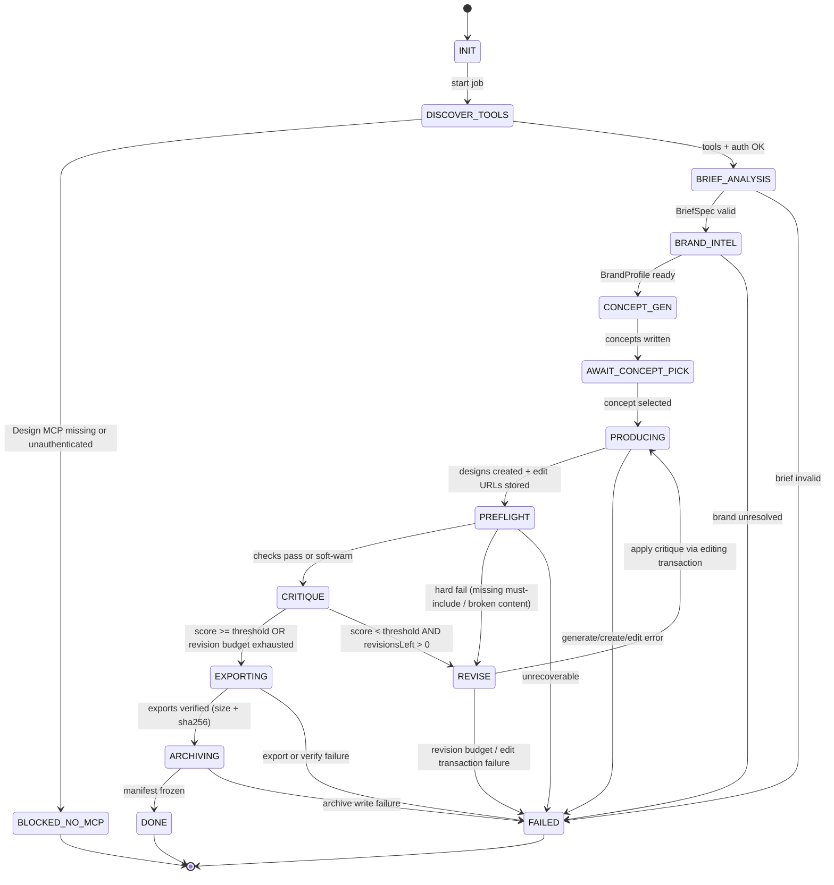

# Design Agent State Machine

Project: **Graphic Design System**  
Owner: Coordinator workflow (single process / agent run)

## Diagram

## State contracts

| State | Entry condition | Exit artifact | Next |
| --- | --- | --- | --- |
| `INIT` | `jobId` assigned | empty job folder | discover |
| `DISCOVER_TOOLS` | live MCP catalog read | `toolDiscovery` on manifest | brief or blocked |
| `BLOCKED_NO_MCP` | no Design MCP tools / auth fail | matrix note | terminal |
| `BRIEF_ANALYSIS` | brief input present | `01-brief.json` | brand |
| `BRAND_INTEL` | brief ready | `02-brand.json` | concepts |
| `CONCEPT_GEN` | brand ready | `03-concepts.json` | pick |
| `AWAIT_CONCEPT_PICK` | ≥1 concept | `selectedConceptId` | produce |
| `PRODUCING` | concept + formats | design IDs + edit URLs | preflight |
| `PREFLIGHT` | designs exist | `04-preflight.json` | critique / revise |
| `CRITIQUE` | preflight done | `05-critique.json` | export / revise |
| `REVISE` | critique instructs changes | edit transaction committed | producing |
| `EXPORTING` | critique accepted | verified files under `exports/` | archive |
| `ARCHIVING` | exports verified | `manifest.json` version bump | done |
| `DONE` | archive complete | frozen job | terminal |
| `FAILED` | any hard error | `error.json` | terminal |

## Transition guards (Milestone 1)

- Formats required: exactly `poster` and `business_card`.
- Max critique revisions: `2`.
- Export verify: `bytes > 0` and `sha256` length `64`.
- Edit URL required on each design before leaving `PRODUCING`.
